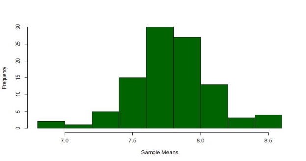
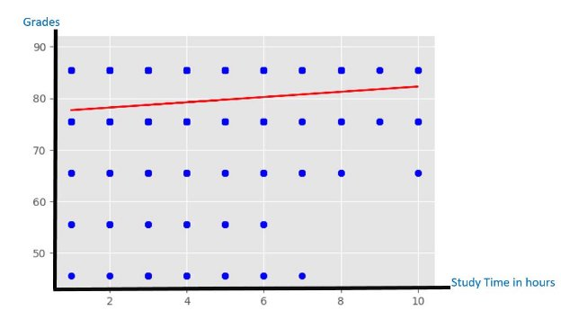

# Does the final grade reveal the whole story?

**Table of Contacts**

1 - **[What’s the most important for students Grades or Learning?](#_page2_x72.00_y461.27) [4**](#_page2_x72.00_y461.27)**

1\.1 - [Conclusion](#_page6_x72.00_y595.30) [7](#_page6_x72.00_y595.30)

2 - **[What’s The Relation Between Students’ Behavior and their Gender related to their grades?](#_page7_x72.00_y191.21) [8**](#_page7_x72.00_y191.21)**

1. - [Is There’s Relation Between Gender & Grades ?](#_page7_x72.00_y645.55) [9](#_page7_x72.00_y645.55)
1. - [Are The Students who like their degree score more than those who don't?](#_page9_x72.00_y93.16) [11](#_page9_x72.00_y93.16)
1. - [Do students’ grades have a relation to their stress levels?](#_page9_x72.00_y679.53) [12](#_page9_x72.00_y679.53)
1. - [Is There A Relationship Between Students’ Extra-Curricular Activities and Their grades?](#_page11_x72.00_y93.16) [13](#_page11_x72.00_y93.16)
1. - [Is There’s A relation between students’ time spent  on social media and their Grades?](#_page12_x72.00_y93.16) [14](#_page12_x72.00_y93.16)
1. - [Conclusions](#_page12_x72.00_y445.81) [14](#_page12_x72.00_y445.81)

3 - **[Online Vs Offline Education](#_page13_x72.00_y72.00) [15**](#_page13_x72.00_y72.00)**

1. - [Comparison About the average study time in Online & Offline learning](#_page13_x72.00_y236.37) [15](#_page13_x72.00_y236.37)
   1. - [Conclusion:](#_page13_x72.00_y583.23) [16](#_page13_x72.00_y583.23)
1. - [How much does Online & Offline Learning Affect the relationship between students' study hours and their grades?](#_page14_x72.00_y93.16) [16](#_page14_x72.00_y93.16)
1. - [The relation between students’ study time and grades In offline education](#_page14_x72.00_y120.32) [16](#_page14_x72.00_y120.32)
1. - [The relation between students’ study time and grades In Online education](#_page14_x72.00_y531.41) [17](#_page14_x72.00_y531.41)
1. - [Conclusion:](#_page15_x72.00_y405.23) [18](#_page15_x72.00_y405.23)
3. - [How much does Online & Offline Learning Affect the average grades of students?](#_page16_x72.00_y93.16) [19](#_page16_x72.00_y93.16)
   1. - [In Traditional education sample](#_page16_x72.00_y120.32) [19](#_page16_x72.00_y120.32)
   1. - [In Online education sample](#_page16_x72.00_y428.39) [19](#_page16_x72.00_y428.39)
   1. - [Conclusions:](#_page17_x72.00_y72.00) [20](#_page17_x72.00_y72.00)
3. - [Is there A relation between students' interest in Practical or Theoretical studies and their preferences in online or offline learning?](#_page17_x72.00_y404.31) [20](#_page17_x72.00_y404.31)
5. - [How does a student's home location affect their preferences in online or offline learning?](#_page18_x72.00_y383.15) [21](#_page18_x72.00_y383.15)
5. - [How does a student's Device Type affect their preferences in online or offline learning? 22](#_page19_x72.00_y93.16)
5. - [How does a student's Internet Facility affect their preferences in online or offline learning?](#_page20_x72.00_y93.16) [23](#_page20_x72.00_y93.16)
5. - [What’s students’ Satisfaction Level with online learning?](#_page21_x72.00_y72.00) [24](#_page21_x72.00_y72.00)
5. - [Conclusions:](#_page22_x72.00_y72.00) [25](#_page22_x72.00_y72.00)

**What’s the most important for students Grades or Learning?**

- I tried to detect what’s more important? grades or output(learning)
- From a survey that was made in 2019 there was a question: Are you more interested in your grades or how much you learn? And these two plots that shows the answers to that question
- Note: - On a scale of 0-10 (where "0" means "Only Grades" ........and "10" means "Only learning")
- We can see that the major is at 10 which is “Only Learning”

So, I needed to estimate the mean of these data so I use sampling distribution, So I took 100 random samples each of size n = 50 > 30 for each sample I find the mean then I find the mean of means and the figure below shows the histogram which is nearly normal distribution and that make me more confident to the data.

I find that the mean after sample distribution is µ = 7.8 and σ = 0.29

- To become sure that my data isn’t biased and ensure that the gender isn’t one of factors that affect my study I make it on different genders (Men and Women)

- From previous graph and by applying hypothesis test on that graph we can detect that it rejects null hypothesis (There is no relation between gender and Choice) because the p-value is very small so we can reject the null hypothesis
- Not Only that I also made it w.r.t GPAs (Are GPAs affect the choice?) (I think no) to detect whether the bad GPAs was one from reasons that students take their opinions on, or their choice based on their decision not because of low GPA

- From that graph and by performing a hypothesis test we can reject the null hypothesis (There is no relation between GPAs and Choice) because the p-value was very small.
  - What about the mean of the choices (Is it greater than 7 or equal or not ?!) by applying hypotheses test: -

**Null hypothesis can’t be rejected** because the value of p is greater than     0.05

**Conclusion**

- The choice of learn or grades clearly doesn’t depend on the gender or on the GPAs
- Grades are short term important, while knowledge is long term important. Grades matter at certain times and are essential to making bigger steps in

your academic path. Knowledge matters consistently through time, and helps you get good grades, but knowledge is also an authentic reflection of your genuine learning.

**What’s The Relation Between Students’ Behavior and their gender related to their grades?**

Behavior and gender is a social construct that varies across cultures and has been disputed since antiquity , We will do some statistics to know more about that

Several Aspects related to student Behavior and gender related to grades would be discussed

**This is the distribution of gender in our data**

The male percentage nearly 66% of the sample while females is 34% of the sample

**Is There’s Relation Between Gender & Grades ?**

- After we did the t-test we found (p-value = 1.17e-05)
- The Independent t-test results are significant (p-value very very small)!
- we can reject **the null hypothesis** in support of **the alternative hypothesis.**
- After that we did regression analysis to see the relation as in binary scale (females = 1 and males = 0)
- with  = slope: [0.00847637] & coefficient of determination: 0.0793
- We could see there’s a weak direct relation between being  female and grades

**Are The Students who like their degree score more than those who don't?**

- The frequency of students answering the question: Do you like your Degree?

- In this sample most of students liked their degree BUT thats’ has no effect on their grades as we could see in regression analysis

- weak direct relationship between students’ grades and like your degree is hard (since the slope is quite small) (**grades no longer depend on do you like degree?**).

**Do students’ grades have a relation to their stress levels?**

- After we did the t-test we found (p-value = 0.2395)
- The Independent t-test results are significant (p-value large than 0.05)
- we can accept **the null hypothesis**.

- We can also see in regression analysis that’s coefficient of determination: 0.005114 which is so small we could reject the relation

**Is There A Relationship Between Students’ Extra-Curricular Activities and Their grades?**

- 51.464% in our data don’t participate in any extracurricular activities

- We did the t-test and found that p-value = 0.068 significant larger than 0.05
- So we accept the null hypotheses
- And On performing linear regression on a dataset sample
- From the next graph we can deduce that there is no relationship between students’ grades and participating in extra activities since the slope is quite horizontal.

**Is There’s A relation between students’ time spent  on social media and their Grades?**

- After we did the t-test we found (p-value = 0.67178)
- The Independent t-test results are significant (p-value large than 0.05)
- we can accept **the null hypothesis**.
- There is no relation between grades and time spent on social media

**Conclusions:**

- There’s a weak direct relation between being  female and  grades
- There's a hard, weak direct relationship between students’ grades and like your degree is hard **we can neglect it**
- There’s no relation between students’ stress levels and their grades
- There’s no direct effect between final grades and the students’ extracurricular activities which means with time management you can achieve both
- There’s no relation between students’ time on social media  and their grades

**Online Vs Offline Education**

A few years ago, online education wasn’t quite familiar. It has begun to gain increasing popularity since the world pandemic (2019) since it was the only means of available education then.

Several Aspects related to online education would be discussed.

**Comparison About the average study time in Online & Offline learning**

- In the case of traditional education, the mean of study hours was found to be:
  - hours.
- A confidence interval with a confidence level of 95% was calculated which is (3.81539461, 4.30170539).
- In the case of online education, the mean of study hours was found to be:
  - hours.
- A confidence interval with a confidence level of 95% was calculated which is (4.257253, 4.5545543).
- On carrying out a hypothesis test on online education data where:
- NULL Hypothesis: µ   = 4.63834 (mean of traditional education study hours)
- Alternative Hypothesis µ!=4.63834 (mean of traditional education study hours)(A two-tail test is used with a confidence of 95%)
- The null hypothesis is rejected and the alternative hypothesis is accepted.

Conclusion:

The average of study hours in the case of online education is not the same as in the case of traditional education.

**How much does Online & Offline Learning Affect the relationship between students' study hours and their grades?**

The relation between students’ study time and grades In offline education

On performing linear regression on a dataset sample describing the observations for several students’ study hours and their grades (out of 100) the following graphical relation was obtained in the case of traditional education

- From the graph we can deduce that there is a strong direct relationship between students’ grades and study times is hard (since the slope is quite large).

The relation between students’ study time and grades In Online education

On performing the same linear regression on a dataset sample describing the observations for several students’ study hours and their grades (out of 100) the following graphical relation was obtained in the case of online education:

- From the graph we can deduce that there is a weak direct relationship between students’ grades and study times is hard (since the slope is quite small) (grades no longer depend on study time in hours).

Conclusion:

The dependency of final grades on the study time in hours decreases on resorting to online education.

**How much does Online & Offline Learning Affect the average grades of students?**

In Traditional education sample

- the average grade was found to be 75.89 with S.D of 20.954
- And the Mode grade range (81-91)
- With frequency histogram plot (using 6-bins):

In Online education sample

- the average grade was found to be 79.5, and the S.D. of 11.63
- the Mode grade range (81-91)
- With frequency histogram plot (using 6-bins):

Conclusions:

- the mean of grades in the case of online education is higher with data more clustered around the mean.
- On carrying out a hypothesis test on online education data where:
- NULL Hypothesis: µ = 75.89385 (mean of traditional education grades)
- Alternative Hypothesis:  µ >75.89385 (mean of traditional education grades)(A one-tail test is used with a confidence of 95%)
- The Null hypothesis was rejected indicating that the mean of grades in the case of online education is not equal to the mean of grades in the case of online education.
- We accept the first hypothesis (the mean of grades is larger in the case of online education) which agrees with our Conclusion.

**Is there A relation between students' interest in Practical or Theoretical studies and their preferences in online or offline learning?**

On testing the student type of study preference in the online education dataset against the number of students the following bar chart was obtained:

- A mean confidence interval with a confidence of 95% was found to be (0.11547470283012962, 0.22400869200381873)

- On carrying out a hypothesis test on online education data where:
- Theoretical was given a value of -1, Practical was given a value of 1 and both were given a value of 0.
- NULL Hypothesis u= - 0.5 (mean of students interested in (majority of students interested in theoretical studies prefer online learning)).
- Alternative Hypothesis u>-0.5 (students interested in practical prefer online learning).
- A one-tail test is used with a confidence of 95%.
- As a result, the Null Hypothesis was rejected and the alternative hypothesis was accepted.

Conclusion:

On the contrary students interested in practical education are more interested in online education.

**How does a student's home location affect their preferences in online or offline learning?**

The following pie chart shows that the majority of students involved in online education are in the urban region

Conclusion:

Facilities (such as stable internet connection)in the urban region make Online education is mor familiar there

**How does a student's Device Type affect their preferences in online or offline learning?**

The following pie chart shows the statistics for device types used by students in online education.

Conclusion:

Online education doesn’t necessarily need a PC or a laptop although it’s the most familiar device among students

**How does a student's Internet Facility affect their preferences in online or offline learning?**

on a scale from 0 to 5 the internet facility of students involved in online education in the sample was measured and the following results were obtained.

Confidence for the mean with a confidence level of 95% was obtained which is: (3.543561043472728, 3.683991232050027)

Conclusion:

Internet Facilities are above average in the case of online education.

**Conclusions:**

**What’s students’ Satisfaction Level with online learning?**

- Students’ satisfaction level with online education was measured in the sample (Bad- Average- Good) with the following results
- Bad was given a value of 0, average was given a value Of 1 and good was given a value of 2.

- On calculating the confidence interval of the Mean with a confidence level of 95%
- It was found to be: (0.9452815672403199, 1.039958285158204)

Conclusion:

In general Students’ satisfaction level with online education is average.

1. The dependency of final grades on the study time in hours decreases on resorting to online education.
1. The mean of grades in the case of online education is higher with data more clustered around the mean.
1. The average of study hours in the case of online education is not the same as in the case of traditional education.
1. On the contrary, students interested in practical education are more interested in online education.
1. Facilities (such as stable internet connection)in the urban region make Online education more familiar there
1. Online education doesn’t necessarily need a Desktop or a Laptop although Laptops are the most familiar device among students.
1. Internet Facilities are above average in the case of online education.
1. In general Students’ satisfaction level with online education is average.
